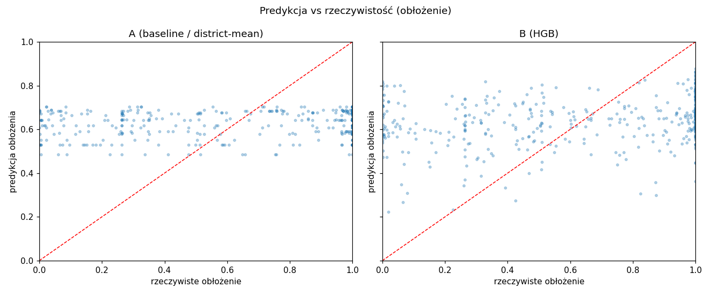

# Raport z eksperymentu A/B — Nocarz

Źródło: `predictions.jsonl` (ruch produkcyjny, routing hash 50/50).

## Przychód — metryki per model (ruch naturalny A/B)

| model | n | RMSE | MAE | R² | mediana AE |
|---|---|---|---|---|---|
| A (baseline / district-mean) | 378 | 47,875 | 31,106 | 0.039 | 22,647 |
| B (HGB) | 422 | 42,937 | 25,156 | 0.181 | 16,964 |

## Przychód — istotność statystyczna (błąd bezwzględny, testy niezależne)

- Mann-Whitney U: p = 9.773e-05
- Welch t-test: p = 0.01882
- Bootstrap 95% CI dla RMSE(A) − RMSE(B): [-8,274, 18,013] EUR

## Przychód — test parowany (wymuszone /a i /b na tych samych ofertach)

- liczba par: 800
- średni |błąd| A = 30,006, B = 25,908 EUR
- Wilcoxon: p = 1.844e-15; t-parowany: p = 4.324e-11

## Werdykt (przychód — główne KPI)

WYGRYWA model B (HGB): MAE 25,156 < 31,106 EUR, RMSE 42,937 < 47,875; różnica istotna (parowany Wilcoxon p=1.8e-15, Mann-Whitney p=9.8e-05). Rekomendacja: wdrożyć B (uwaga: luka RMSE nieistotna, 95% CI = [-8,274, 18,013] — RMSE zdominowane przez ciężki ogon błędów; przewaga B dotyczy ofert typowych).

## Obłożenie — metryki per model (drugorzędny wynik Canvas)

| model | n | RMSE | MAE | R² | mediana AE |
|---|---|---|---|---|---|
| A (baseline / district-mean) | 378 | 0.3602 | 0.3247 | 0.026 | 0.3247 |
| B (HGB) | 422 | 0.3542 | 0.3094 | 0.059 | 0.3086 |

- Mann-Whitney U (|błąd| obłożenia): p = 0.04542

- Test parowany (Wilcoxon) obłożenia: p = 2.434e-05 (śr. |błąd| A=0.3253, B=0.3083)

## Wykresy

