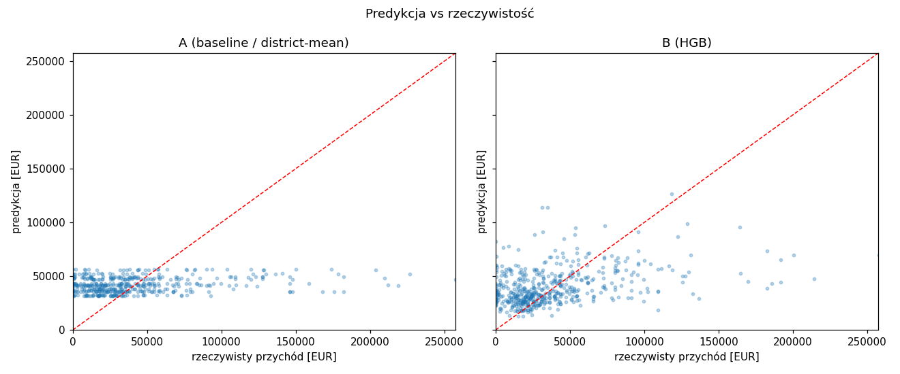
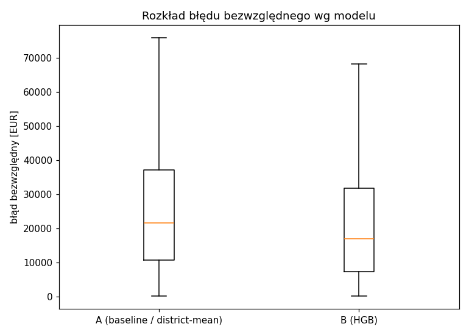
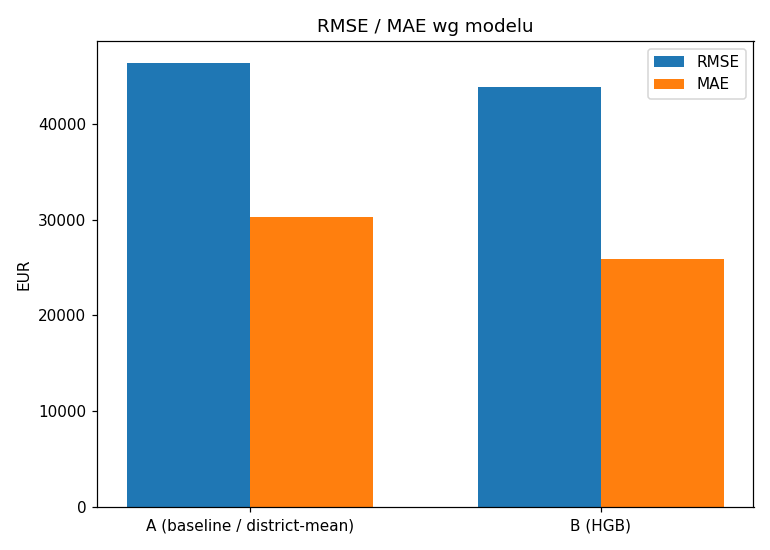

# Raport z eksperymentu A/B — Nocarz

Źródło: `predictions.jsonl` (ruch produkcyjny, routing hash 50/50).

## Metryki per model (ruch naturalny A/B)

| model | n | RMSE | MAE | R² | mediana AE |
|---|---|---|---|---|---|
| A (baseline / district-mean) | 464 | 46,280 | 30,261 | 0.035 | 21,490 |
| B (HGB) | 536 | 43,854 | 25,872 | 0.161 | 16,894 |

## Istotność statystyczna (błąd bezwzględny, testy niezależne)

- Mann-Whitney U: p = 0.0001839
- Welch t-test: p = 0.04976
- Bootstrap 95% CI dla RMSE(A) − RMSE(B): [-8,876, 13,486] EUR

## Test parowany (wymuszone /a i /b na tych samych ofertach)

- liczba par: 1,000
- średni |błąd| A = 29,797, B = 25,724 EUR
- Wilcoxon: p = 6.539e-21; t-parowany: p = 5.265e-16

## Werdykt

WYGRYWA model B (HGB): MAE 25,872 < 30,261 EUR, RMSE 43,854 < 46,280; różnica istotna (parowany Wilcoxon p=6.5e-21, Mann-Whitney p=0.00018). Rekomendacja: wdrożyć B (uwaga: luka RMSE nieistotna, 95% CI = [-8,876, 13,486] — RMSE zdominowane przez ciężki ogon błędów; przewaga B dotyczy ofert typowych).

## Wykresy

